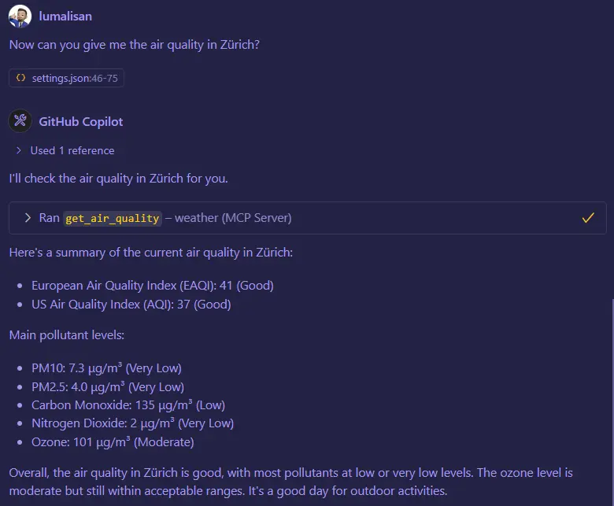
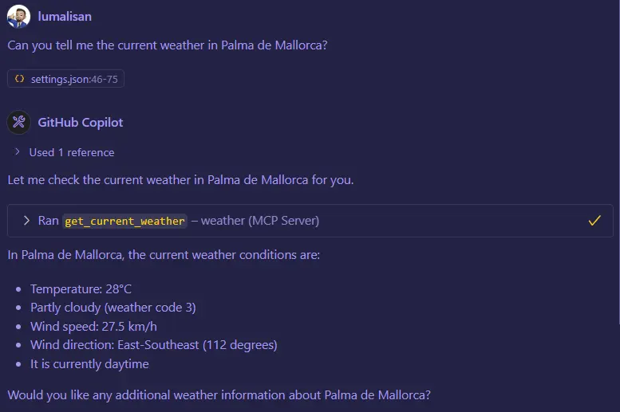
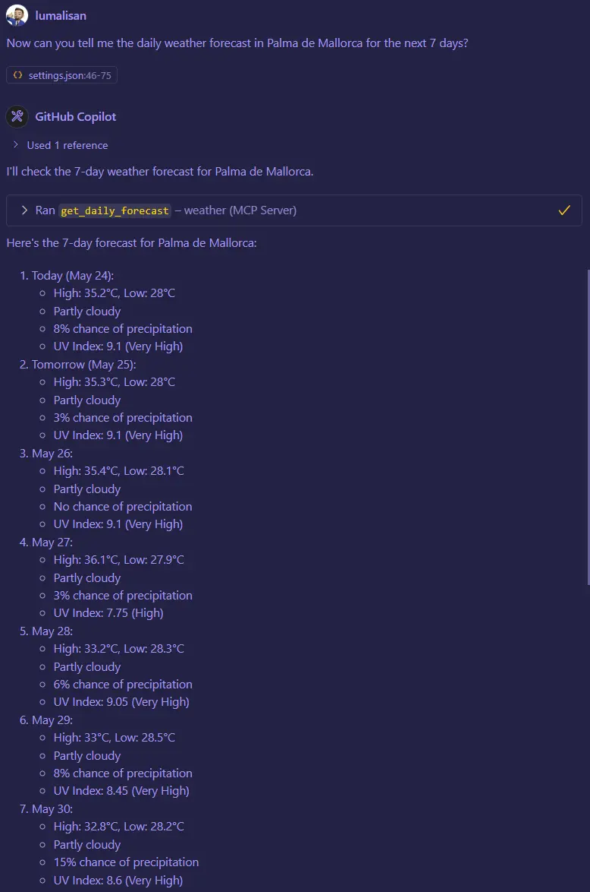
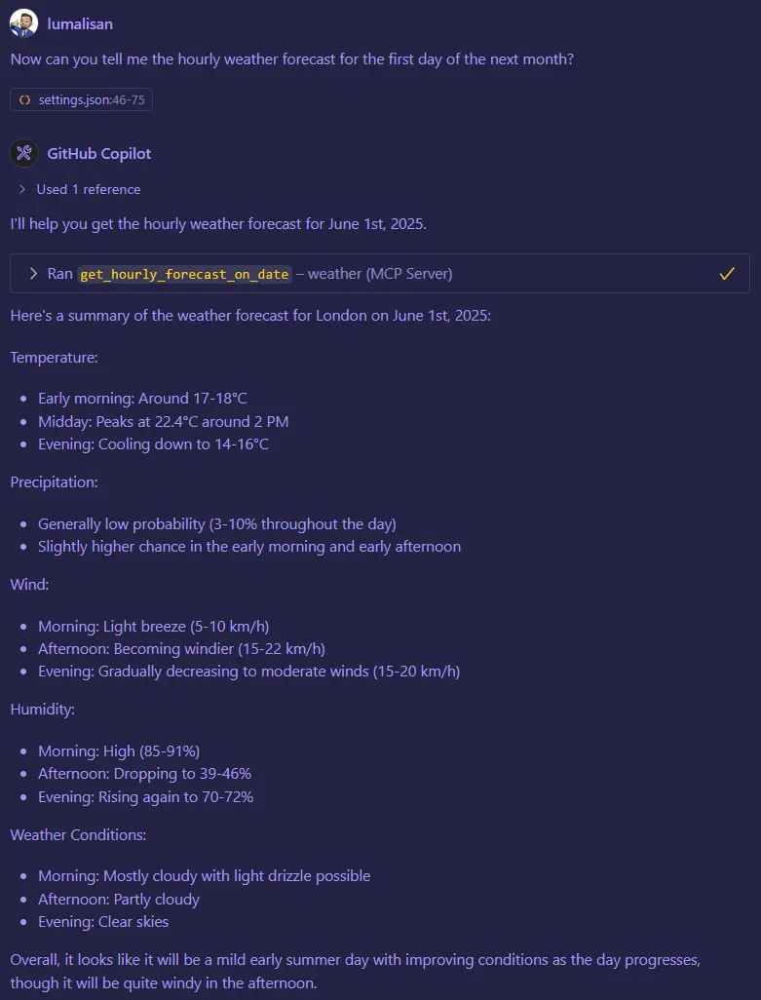
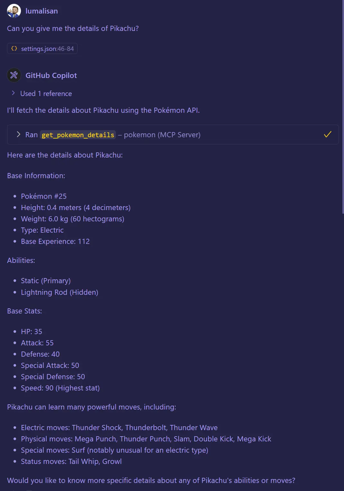
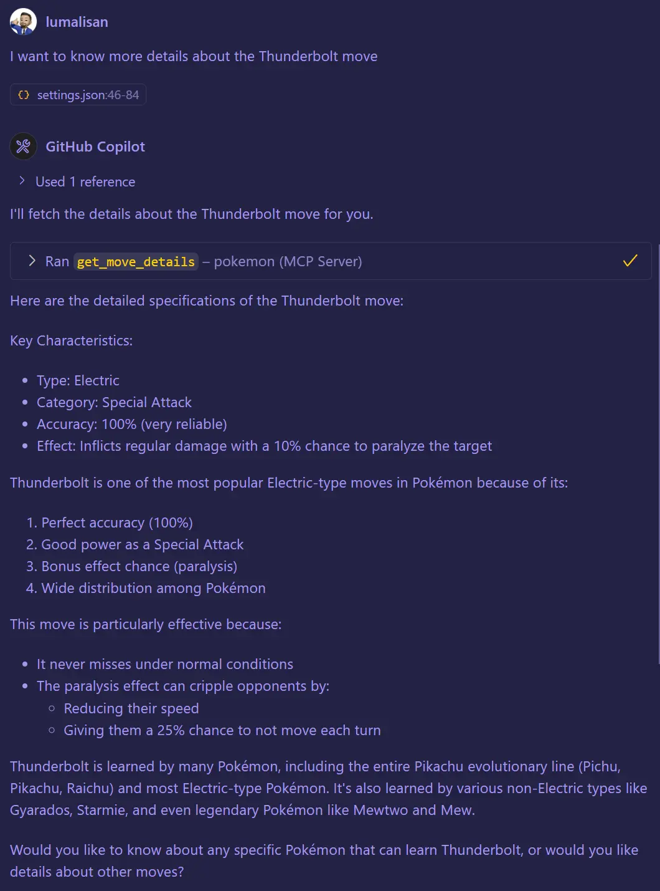
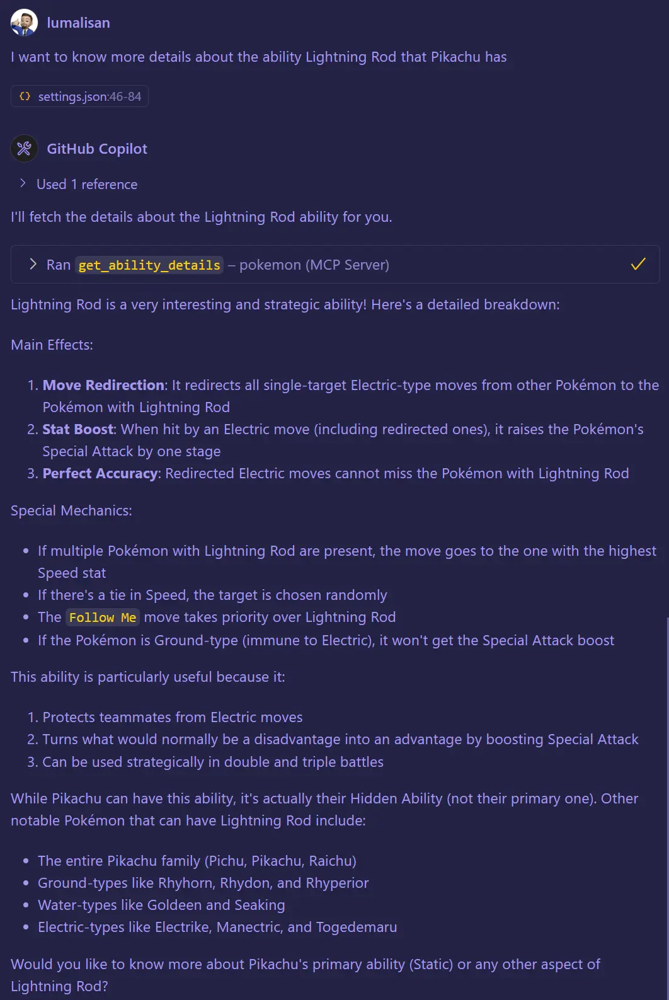

# Model Context Protocol (MCP) Server Collection w/ Typescript

## 🎯 About This Collection
Welcome to my repository of Model Context Protocol (MCP) server implementations!

This project showcases a variety of custom-built servers designed to explore and demonstrate the power of the Model Context Protocol. MCP is an emerging standard that aims to streamline how Large Language Models (LLMs) securely connect to and utilize diverse data sources, external APIs, and other tools. My goal here is to provide practical, hands-on examples of how MCPs can act as bridges, enabling LLMs to perform more complex, context-aware tasks by interacting with real-world services.

Feel free to explore the code, see how different MCPs are structured, and get inspired!

## ✨ What You'll Find Inside
Here are some key aspects and examples of MCPs you can explore:

* **Diverse Service Integrations:** Working MCP server examples that connect LLMs to various useful services, including:
    * ☀️ **Weather MCP:** Provides current weather, daily/hourly forecasts, and air quality data (using the Open-Meteo API).
    * 👾 **Pokémon API MCP:** Allows LLMs to fetch detailed information about Pokémon, their abilities, stats, and more (using PokéAPI).
* **Practical MCP Implementation:** Each project demonstrates core MCP concepts like tool definition, input/output schemas (using Zod), and communication handling via the MCP SDK.
* **Empowering LLMs:** Clear examples of how these servers can provide LLMs with the necessary context and capabilities to answer specific queries or perform actions.
* **Modular & Understandable Code:** A focus on clean, organized code. For instance, the Weather MCP demonstrates decoupled logic for API calls and geocoding for better maintainability.

## 🚀 Core Technologies Used
The following technologies and tools are commonly used across these MCP projects:

* **Runtime Environment:** [Node.js](https://nodejs.org/)
* **MCP Development:** [@modelcontextprotocol/typescript-sdk](https://github.com/modelcontextprotocol/typescript-sdk)
* **Language:** TypeScript
* **Schema Definition & Validation:** [Zod](https://zod.dev/)
* **Key APIs Integrated (Examples):**
    * [Open-Meteo API](https://open-meteo.com/)
    * [PokéAPI](https://pokeapi.co/)

## 📂 Repository Structure & Usage
This repository is organized with each distinct MCP server implementation residing in its **own dedicated directory** (e.g., `01-weather/`, `02-pokemon/`).

To get started with a specific MCP:
1.  Clone this repository.
2.  Navigate into the directory of the MCP you're interested in.
3.  Run `pnpm install` (or the package manager you like the most).
4.  Run `pnpm dev` to try the MCP Inspector.
5.  When you are ready to try the MCP with the AI you need to configure it. This will depend on your client, but a typical configuration look like this:
```js
{
    "mcpServers": {
        "weather": {
            "type": "stdio",
            "command": "npx",
            "args": [
                "-y",
                "tsx",
                "[your local path to \01-weather]"
            ]
        }
    }
}
```

### Install in VS Code
You can also install the MCP servers using the VS Code CLI:

```bash
# For the weather MCP server
code --add-mcp '{"name":"weather","command":"npx","args":["-y","tsx","[your local path to \01-weather]"]}'
```

After installation, the MCP server will be available for use with your GitHub Copilot agent in VS Code.

Most servers here are designed to communicate via `stdin/stdout` using the `StdioServerTransport` from the MCP SDK, as shown in the examples.

## Screenshots

### Weather MCP






### Pokemon MCP





---

Happy coding, and I hope you find these MCP examples useful!
